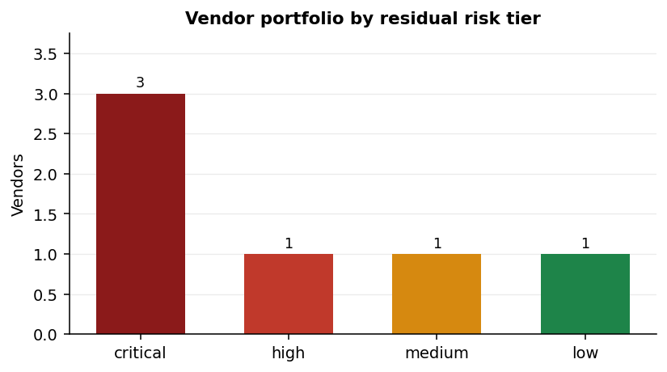
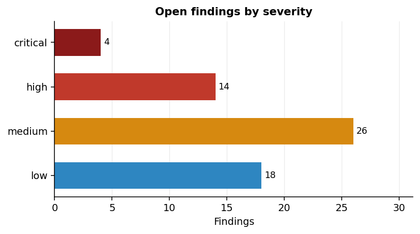
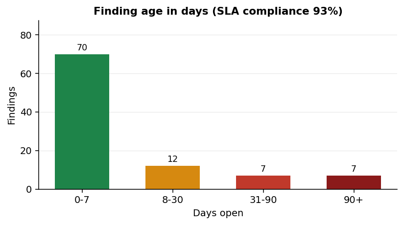
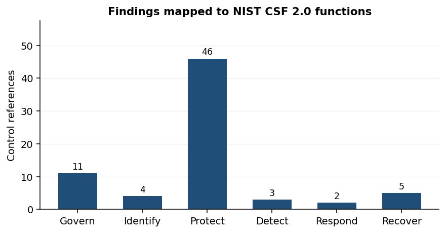
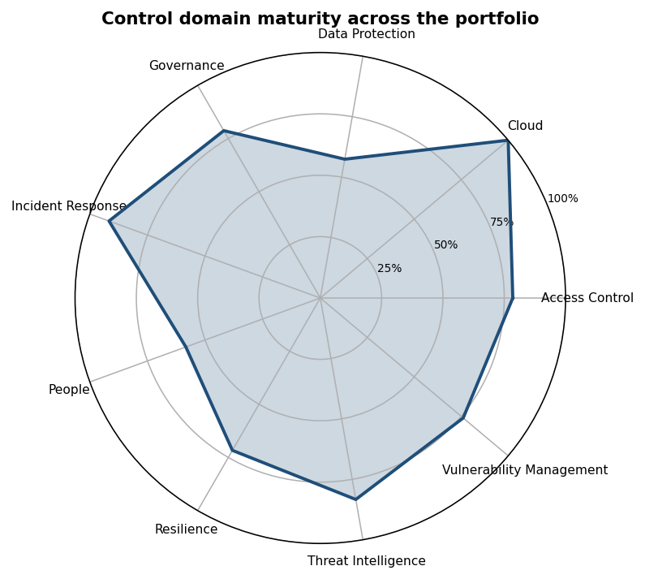
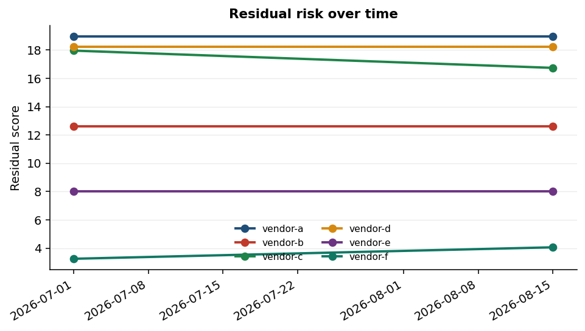

# AssureOps

**A cyber assurance toolkit for third party risk, access recertification and remediation SLA governance.**
Weighted vendor assessment, observed security posture, identity governance rules and a remediation
clock, every finding mapped to an ISO/IEC 27001:2022 Annex A control and a NIST CSF 2.0 function,
with a tamper evident record of every decision.


---

## Why this exists

Third party assurance is mostly a paperwork exercise until something goes wrong. A vendor returns a
questionnaire, somebody records that it came back, and the file closes. The problems with that are
well known and rarely fixed:

- **Self attestation is unverified.** A supplier saying their controls are good is the weakest form
  of assurance there is, and most scoring models treat it as if it were the strongest.
- **Findings have no clock.** A critical gap identified in March is still open in September because
  nothing tracked it.
- **Scores cannot be explained.** A vendor asks why they scored 62 and nobody can answer.
- **Access reviews drift.** Recertification happens annually, in a spreadsheet, and segregation of
  duties conflicts spanning two systems are invisible to whoever reviews each system separately.

AssureOps addresses each of those directly. Attestation is capped so it can never reach full
effectiveness on its own. Every finding gets a remediation deadline from the moment it is raised.
Every weight and threshold in the scoring model is documented in
[`docs/risk-methodology.md`](docs/risk-methodology.md), limitations included. Access rules evaluate
per principal across every system, so a conflict split across two applications still surfaces.

## What it does

### Third party security assessment

A 22 question weighted assessment across nine control domains, each question carrying the Annex A
control it evidences. Answers are a three point scale, because "in progress with a documented plan"
is genuinely different from "no". Three questions are marked critical: MFA on administrative access,
encryption in transit, and contractual breach notification. Answering `no` to any of them raises a
critical finding regardless of how the rest of the questionnaire scores.

### Observed security posture

Evidence to sit alongside what the vendor claims: negotiated TLS version, certificate expiry, self
signed and hostname mismatch detection, and the presence of six security headers. Posture is
weighted at 0.35 against the questionnaire's 0.65, which is heavy for its narrow scope because it is
observed rather than asserted.

### Identity governance and access recertification

Rules over an entitlement extract: dormant accounts, dormant *privileged* accounts on a tighter
threshold, missing MFA, entitlements retained on disabled accounts, overdue recertification, and
segregation of duties conflicts evaluated per principal across all systems.

### Remediation SLA governance

Deadlines by severity, breach and approaching breach detection, aging buckets, compliance rate and
mean days open. An open findings register from prior cycles can be merged in, so remediation clocks
run from when a finding was first raised rather than restarting at every assessment.

### Continuous monitoring

A single assessment is a photograph. `assureops trend` compares each vendor's two most recent
`assess` cycles and reports what actually changed: residual score delta, a velocity figure (change
per day, so a slow drift and a sudden spike don't look the same), tier movement, and which findings
are new versus resolved since last time. It shares the exit code contract with every other
command, so a portfolio that is quietly getting worse can trip a pipeline gate exactly like a fresh
critical finding does.

Snapshots are not a second file format sitting next to the audit log — they are ordinary audit
records. Every `assess` cycle writes one `trend_snapshot` per vendor into the same hash chained
trail everything else goes through, so the trend history is exactly as tamper evident as the
findings and decisions it is built from. See
[the architecture doc](docs/architecture.md#continuous-monitoring) for why that mattered enough to
build it this way rather than the more obvious route.

---

## Results on the sample portfolio

Everything below is produced by `make demo` against the synthetic data in `config/samples/`. No real
third party is referenced or contacted anywhere in this repository.

```
$ assureops assess --config config/assureops.example.yaml \
    --vendors config/samples/vendors.csv \
    --answers config/samples/answers.csv \
    --observations config/samples/observations.json \
    --findings config/samples/findings.csv \
    --as-of 2026-08-22 --i-am-authorised --report docs

Assessed 6 vendors as at 2026-08-22
  Risk tiers      : {'critical': 3, 'high': 1, 'medium': 1, 'low': 1}
  Findings        : {'high': 14, 'medium': 26, 'low': 18, 'critical': 4}
  SLA compliance  : 92.7% (7 breached)
  vendor-a       tier=critical residual= 18.97  findings=11
  vendor-d       tier=critical residual= 18.25  findings=7
  vendor-c       tier=critical residual= 17.96  findings=24
  vendor-b       tier=high     residual= 12.61  findings=3
  vendor-e       tier=medium   residual=  8.02  findings=14
  vendor-f       tier=low      residual=  3.25  findings=3
```

Exit code 2, because findings reached the configured `fail_on` threshold. The same binary therefore
works as a pipeline gate.

### Portfolio risk distribution



Three vendors land in the critical band. Worth reading alongside the finding counts: `vendor-d` is
critical on **7** findings while `vendor-c` is critical on **24**. That is the impact dimension
doing its job. Both handle restricted data, so a smaller number of unresolved gaps still produces a
high residual score. Counting findings alone would have ranked these two very differently.

### Findings by severity



The shape here is the point. Four critical findings against 26 medium is what a real portfolio looks
like, and it is why severity ordering had to be correct rather than approximately correct — see
[the bug note below](#a-bug-worth-describing).

### Remediation SLA and finding age



92.7% compliance with seven breached findings, the oldest 173 days past its due date. Fourteen of
the 34 register findings are more than 30 days old. This is the view that turns "we have findings"
into "these seven are overdue and here is by how much".

### Control coverage against NIST CSF 2.0



Every finding carries Annex A control references, which map through to CSF functions. The
concentration in **Protect** reflects a portfolio whose weaknesses are preventative: access control,
authentication and cryptography. A portfolio weighted toward **Detect** and **Respond** would call
for an entirely different remediation programme, which is the argument for reporting this way rather
than as a flat finding count.

### Control domain maturity



Mean questionnaire score per domain across all six vendors. Access Control and Data Protection are
the weakest areas, which is consistent with the CSF distribution above and points at where a
supplier improvement programme should start.

### Residual risk over time

`make demo-trend` runs the sample portfolio through two cycles six weeks apart, with vendor-c
working through part of its questionnaire gaps and vendor-f's certificate slipping toward expiry
in between.

```
$ assureops trend --config config/assureops.example.yaml --report var/reports

Trend analysis across 6 vendor(s), 12 snapshot(s) on record
  Regressed      : 1
  Improved       : 1
  New findings   : {'low': 1}
  Resolved       : 6
  REGRESSED vendor-f       residual   3.25 to   4.06 (+0.81, +0.018/day)  low to medium
```



vendor-c's line is the one worth reading twice: six answered gaps closed, residual score fell from
17.96 towards 16.7, and none of it shows up in the regression count above because nothing there
needed a trend command to notice — a single `assess` diffed against the last one already would have
missed it, since the questionnaire result alone does not carry last cycle's number to compare
against. vendor-f is the opposite case: a two point rise driven by one certificate getting closer to
expiry is exactly the kind of change a point in time report states without flagging, and exactly
what tripped `regressed` here.

A full generated report is committed at [`docs/assurance_report.md`](docs/assurance_report.md).

---

## Authorised use only

External checks are gated three ways, because a tool that probes third party infrastructure needs to
make unauthorised use difficult by accident.

| Control | Effect |
| --- | --- |
| Explicit authorisation | With `require_authorisation` on, which is the default, nothing runs without `--i-am-authorised` |
| Allow list | Only hosts in `scope.allow` are ever probed |
| Hard deny list | Twenty well known domains can never be assessed, **regardless of configuration** |
| Protected ranges | Loopback, private, link local and reserved addresses refused unless explicitly enabled |

The deny list is a module level constant that no configuration key can reach, and there are tests
asserting that putting a denied domain in the allow list does not defeat it:

```python
def test_blocks_well_known_domains(self, domain):
    guard = ScopeGuard(allow=frozenset({domain}), require_authorisation=False)
    with pytest.raises(ScopeError, match="deny list"):
        guard.check(domain)
```

Out of scope is a recorded outcome rather than a crash. A vendor whose domain is not on the allow
list is still assessed on its questionnaire, with a `suppressed` entry written to the audit trail.

---

## Tamper evident audit trail

Every decision, including the suppressed ones, is appended to a hash chained log. Each record
carries the digest of the record before it, so editing, deleting or reordering any line breaks the
chain and verification reports the exact sequence number where it broke.

```
$ assureops audit verify --path var/audit/assureops_audit.jsonl
Audit chain verified: 13 records intact

$ assureops audit verify --path var/audit/tampered.jsonl
Audit chain BROKEN at record 4: record digest does not match contents
```

Set `ASSUREOPS_AUDIT_HMAC_KEY` and the chain becomes keyed, so an attacker who can write to the file
but does not hold the key cannot forge a record that verifies. The test suite proves this rather
than asserting it in prose:

```python
def test_forged_record_fails_without_the_key(self, tmp_path):
    keyed = AuditLog(path, hmac_key=b"correct-key")
    keyed.append("a", "ok")
    assert keyed.verify().ok

    attacker = AuditLog(path, hmac_key=b"wrong-key")
    attacker.append("evil", "ok")
    assert not keyed.verify().ok
```

---

## Quick start

```bash
git clone https://github.com/shaaamray/AssureOps.git
cd AssureOps
make dev

assureops validate --config config/assureops.example.yaml
make demo
make demo-trend   # two assess cycles, then the change between them
```

### Commands

| Command | Purpose |
| --- | --- |
| `assureops validate` | Parse and validate configuration, then exit |
| `assureops assess` | Assess a vendor portfolio, optionally writing a report |
| `assureops trend` | Report change in vendor risk since the last assess cycle |
| `assureops access-review` | Run an access recertification review |
| `assureops sla-report` | Report remediation SLA status |
| `assureops audit verify` | Verify the audit hash chain end to end |
| `assureops audit tail` | Show the most recent audit records |

### Access review output

```
$ assureops access-review --config config/assureops.example.yaml \
    --entitlements config/samples/entitlements.csv --as-of 2026-08-22

Reviewed 42 entitlements (23 privileged)
  Findings: {'critical': 7, 'high': 16, 'medium': 25}
  [critical] i.rossi@example-insurance.com      Segregation of duties conflict
  [critical] j.kowalski@example-insurance.com   Segregation of duties conflict
  [critical] l.dubois@example-insurance.com:ERP Privileged account without MFA
```

---

## Configuration

Strictly validated. Unknown keys are rejected rather than ignored, and every error names the exact
dotted path, because a monitoring or assurance tool that silently swallows a typo is worse than no
tool at all.

```yaml
organisation: Example Insurance Group

scope:
  allow:
    - vendor-a.example
    - vendor-b.example
  allow_private: false
  require_authorisation: true

assessment:
  posture_enabled: true
  fail_on: high        # exit code 2 at this severity or above

sla:
  critical_days: 7
  high_days: 30
  medium_days: 90
  low_days: 180

audit:
  path: var/audit/assureops_audit.jsonl
  hmac_key_env: ASSUREOPS_AUDIT_HMAC_KEY

trend:
  enabled: true
  regression_delta: 2.0   # flag a vendor once its residual score rises past this
```

Secrets never live in the file. Reference the environment instead with `${ENV:NAME}` or
`${ENV:NAME:default}`. The loader also recognises credential shaped literals — AWS keys, GitHub and
Slack tokens, JWTs, PEM private key blocks — and refuses to start if one is pasted in, turning an
accidental commit of a secret into a startup failure instead of a breach.

---

## Test results

```
$ make cover

Name                             Stmts   Miss Branch BrPart  Cover
-------------------------------------------------------------------
src/assureops/__init__.py            2      0      0      0   100%
src/assureops/access_review.py      51      0     20      0   100%
src/assureops/audit.py              84      0     24      2    98%
src/assureops/cli.py               197      4     30      3    97%
src/assureops/config.py             67      1     36      1    98%
src/assureops/errors.py              6      0      0      0   100%
src/assureops/frameworks.py         36      0      6      0   100%
src/assureops/ingest.py             73      1     26      0    99%
src/assureops/models.py             97      3     20      3    95%
src/assureops/pipeline.py           77      0     24      1    99%
src/assureops/posture.py            88      0     26      1    99%
src/assureops/questionnaire.py      68      0     14      0   100%
src/assureops/redaction.py          27      0     12      0   100%
src/assureops/reporting.py         164      4     16      1    96%
src/assureops/risk.py               52      1     14      1    97%
src/assureops/scope.py              62      0     20      0   100%
src/assureops/sla.py                78      0     22      0   100%
src/assureops/trend.py             105      0     18      0   100%
-------------------------------------------------------------------
TOTAL                             1334     14    328     13    98%

369 passed in 3.71s
```

**369 tests at 98% coverage with branch coverage enabled.** Ruff and Bandit both report clean. CI
runs lint, the security scan, the full suite with a 95% coverage floor, and an end to end demo run
on Python 3.11, 3.12 and 3.13.

Every test runs offline. The posture prober is a pluggable callable, so TLS evaluation, header
scoring and scope enforcement are all exercised without a single network call — which also means the
test suite never touches infrastructure belonging to anyone else.

| Area | Tests | What they cover |
| --- | ---: | --- |
| Scope guard | 34 | Deny list precedence, authorisation gating, protected ranges, malformed hosts |
| Risk engine | 33 | Weighting, penalty caps, tier boundaries, determinism |
| Questionnaire | 32 | Weighted scoring, partial credit, critical gaps, bank integrity |
| Trend detection | 29 | Snapshot round tripping, grouping correctness, tier rank vs alphabetical order |
| Posture | 26 | TLS, certificate and header evaluation, scoring bounds |
| CLI | 24 | Every command including `trend`, exit code contract, report generation |
| Models | 22 | Severity ordering, construction time validation, immutability |
| Redaction | 22 | Key name and value shape redaction, structure preservation |
| Config loading | 22 | Strict key rejection, env interpolation, credential rejection |
| Pipeline | 20 | End to end assessment, scope suppression, audit integration |
| Access review | 19 | Dormancy thresholds, MFA, orphaned access, cross system SoD |
| Audit chain | 18 | Edit, deletion, reordering and forgery detection, keyed chains |
| SLA governance | 18 | Status transitions, aging buckets, compliance maths |
| Ingest | 17 | CSV and JSON parsing, type coercion, error reporting |
| Frameworks | 13 | Control resolution, CSF mapping, coverage counts |
| Reporting and error paths | 20 | Chart output including the trend line chart, markdown rendering, exception mapping |

### A bug worth describing

`Severity` subclasses `str` so it serialises cleanly to JSON and CSV. That inherits string
comparison, which orders values alphabetically — meaning `Severity.CRITICAL > Severity.HIGH`
silently returned `False`, because `"critical" < "high"`.

Severity ordering drives remediation SLA windows and the CI failure gate, so this would have meant
critical findings being assigned the wrong deadline and a pipeline gate that failed to trip. All
four comparison operators are now overridden against an explicit rank table, and a regression test
asserts the enum deliberately disagrees with alphabetical ordering:

```python
def test_alphabetical_would_disagree(self):
    assert str(Severity.CRITICAL.value) < str(Severity.LOW.value)
    assert Severity.CRITICAL > Severity.LOW
```

---

## Project layout

```
src/assureops/
├── cli.py             command line interface and exit code contract
├── config.py          strict loading, env interpolation, secret rejection
├── models.py          typed domain objects, validated on construction
├── scope.py           authorisation guard: allow list, deny list, ranges
├── questionnaire.py   weighted assessment bank and scoring
├── posture.py         TLS, certificate and header evaluation
├── risk.py            impact, likelihood, effectiveness, residual, tiers
├── access_review.py   identity governance and recertification rules
├── sla.py             remediation clocks, aging, compliance metrics
├── frameworks.py      ISO 27001 Annex A and NIST CSF 2.0 mapping
├── trend.py           change detection between assess cycles
├── pipeline.py        orchestration
├── audit.py           hash chained tamper evident log
├── redaction.py       redaction by key name and value shape
├── ingest.py          CSV and JSON loading
└── reporting.py       markdown report and chart generation
```

## Documentation

- [Risk methodology](docs/risk-methodology.md) — every weight and threshold, with limitations
- [Architecture](docs/architecture.md) — design decisions and the shape of a run
- [Security policy](SECURITY.md) — authorised use, secret handling, audit integrity
- [Contributing](CONTRIBUTING.md) — conventions for new rules and tests

## Roadmap

- Evidence attachment and expiry tracking against questionnaire responses
- Native connectors for Microsoft Entra ID entitlement extracts
- SOC 2 Trust Services Criteria as a third mappable framework
- Trend aware access review, applying the same regression detection to identity findings
- Signed release artefacts and a software bill of materials

## License

MIT. See [LICENSE](LICENSE).
